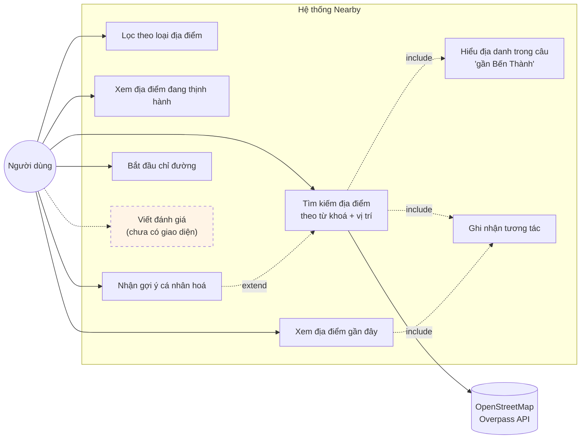
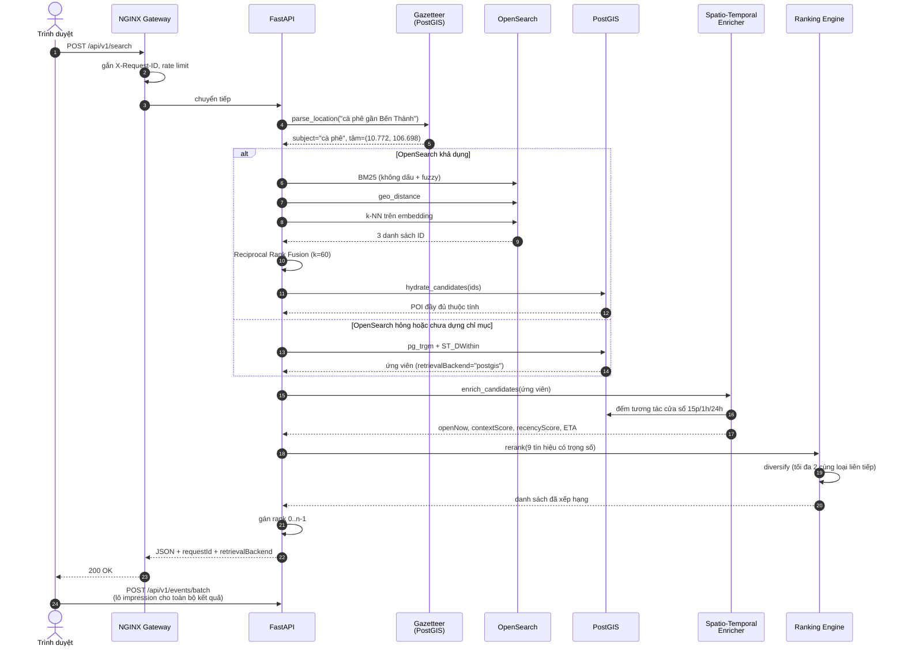
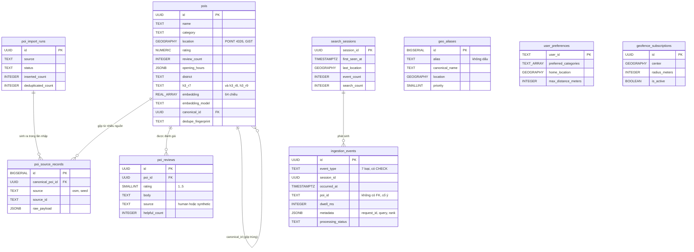
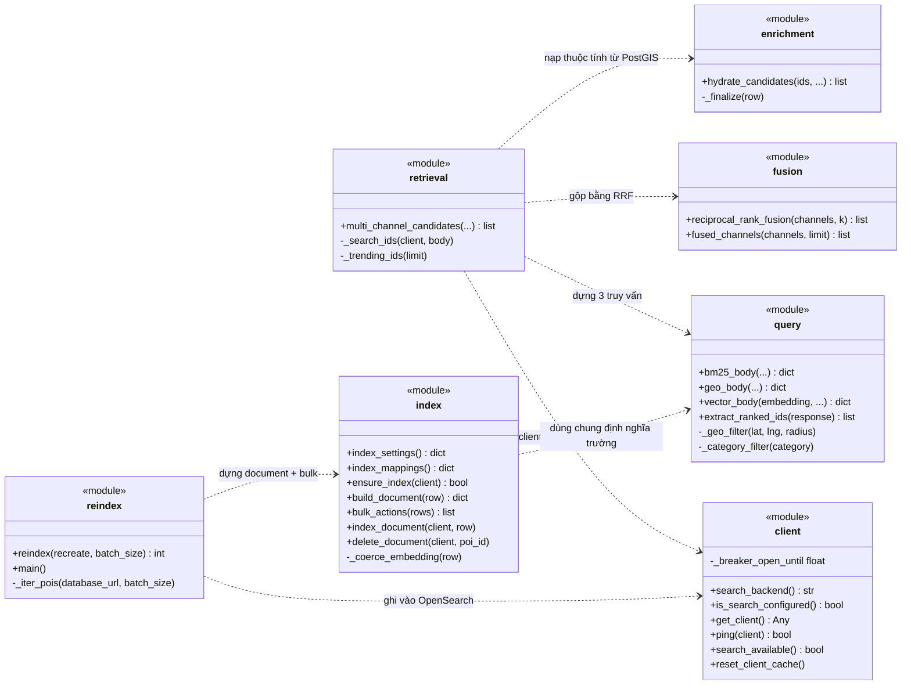

# Sơ đồ UML

Bốn sơ đồ dưới đây được dựng từ code thật, không vẽ thứ chưa tồn tại. Mỗi sơ đồ
ghi rõ nguồn đối chiếu để người đọc kiểm tra được.

Cú pháp Mermaid — GitHub, VS Code và Artifact đều render trực tiếp, không cần cài
thêm công cụ. Để xuất ảnh chèn vào bản Word, dùng https://mermaid.live rồi tải PNG/SVG.

---

## 1. Sơ đồ Use Case

Nguồn: các endpoint trong `backend/app/api.py` và bảng chức năng ở `docs/layer-3.md`.

Chỉ vẽ những chức năng đã có endpoint thật. "Viết đánh giá" được đánh dấu riêng
vì phía tiêu thụ (ranking, feature store, knowledge graph) đã sẵn sàng nhưng
phía phát sự kiện chưa có giao diện — xem bước A3 trong lộ trình.

| Use case | Endpoint | Vị trí |
|---|---|---|
| Tìm kiếm địa điểm | `POST /api/v1/search` | `api.py` — `contextual_search` |
| Xem địa điểm gần đây | `GET /api/pois/nearby` | `api.py` — `nearby_pois` |
| Lọc theo loại địa điểm | `GET /api/v1/categories` | `api.py` — `list_categories` |
| Xem thịnh hành | `GET /api/v1/trending` | `api.py` — `trending` |
| Gợi ý cá nhân hoá | `GET /api/v1/recommendations` | `api.py` — `recommendations` |
| Ghi nhận tương tác | `POST /api/v1/events/batch` | `api.py` — nhận `EventBatch` |
| Viết đánh giá | *chưa có* | loại `review` đã được `models.py` chấp nhận |

---

## 2. Sơ đồ tuần tự — `POST /api/v1/search`

Nguồn: `docs/layer-1.md`, `backend/app/api.py`, `backend/app/search/retrieval.py`,
`backend/app/spatio_temporal.py`, `backend/app/ranking.py`.

Điểm đáng chú ý về mặt thiết kế: nhánh `alt` ở giữa là circuit breaker thật
(`backend/app/search/client.py`). Khi OpenSearch không khả dụng, hệ thống rơi về
PostGIS và **vẫn trả kết quả**, chỉ đổi trường `retrievalBackend` trong phản hồi.

---

## 3. Sơ đồ ERD

Nguồn: `0001_initial_schema.py` và `0003_enrich_poi_model.py`. Chỉ liệt kê cột
tiêu biểu; số cột đầy đủ ghi trong ngoặc.

Lưu ý về quan hệ: `ingestion_events.poi_id` là `TEXT` và **không có khoá ngoại**
tới `pois` — cố ý, vì log sự kiện phải nhận được cả POI đã bị xoá và cả id rác từ
client mà không làm hỏng luồng ghi. Đổi lại, mọi truy vấn thống kê đều phải
`JOIN pois` và chấp nhận việc bỏ qua âm thầm các id không khớp.

---

## 4. Sơ đồ lớp — gói `backend/app/search/`

Nguồn: các module thật trong `backend/app/search/`. Gói này viết theo kiểu
module-hàm chứ không phải lớp, nên sơ đồ dùng `<<module>>` để phản ánh đúng cấu
trúc code thay vì bịa ra các lớp không tồn tại.

**Luồng đọc sơ đồ**: `retrieval` là điểm vào. Nó hỏi `client` xem OpenSearch có
dùng được không (circuit breaker), nhờ `query` dựng ba thân truy vấn, gọi
OpenSearch ba lần, đưa ba danh sách ID cho `fusion` gộp lại bằng Reciprocal Rank
Fusion, rồi nhờ `enrichment` nạp thuộc tính đầy đủ từ PostGIS. Nhánh ghi
(`reindex` → `index`) chạy độc lập, thường là một job riêng.
